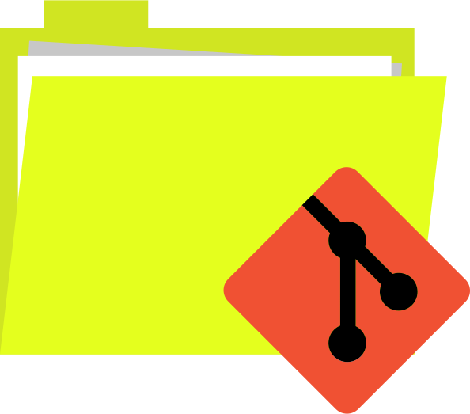

<div align="center" style="text-align: center;">
  <!-- Project Title -->
  <a href="https://framagit.org.rdeville.public/my_dotfiles/myrepos">
    
    <h1>MyRepos Template</h1>
  </a>

  <a href="https://opensource.org/licenses/MIT">
    
  </a>
  <a href="https://framagit.org/rdeville.public/my_dotfiles/myrepos/commits/master">
    
  </a>
</div>

--------------------------------------------------------------------------------

<div align="center" style="text-align: center;">
<b>Scaffolding repo to setup <a
href="https://myrepos.branchable.com/">myrepos</a> using user configuration.</b>
</div>

--------------------------------------------------------------------------------

Main repo is on [ Framagit][myrepo_repo_url]. On another online git platforms,
their are just mirror of the main repo. Any issues, pull/merge requests, etc,
might not be considered on those other platforms.

--------------------------------------------------------------------------------


# Table of Content

* [Description](#description)
* [Software Requirements](#software-requirements)
* [Usage](#usage)
  * [Manually configure host](#manually-configure-host)
  * [Automatically configure host](#automatically-configure-host)
* [Documentation](#documentation)

# Description

From [myrepos][myrepos]:

> You have a lot of version control repositories. Sometimes you want to update
> them all at once. Or push out all your local changes. You use special command
> lines in some repositories to implement specific workflows. Myrepos provides a
> `mr` command, which is a tool to manage all your version control repositories.

In other terms, with [myrepos][myrepos], once configured, the command `mr push`
will push all your configured version control repositories at once.

This current repository propose you a script allowing you to automate the
configuration of myrepos from a user configuration file. The script will
generate a myrepos files for each configured repos and, if ask to do so, it will
update the configuration of the current host.

Moreover, the script also handle the use of [vcsh][vcsh] to also manage your
dotfiles.


# Software Requirements

In this section we will only describe external requirements, i.e. the
requirements that are not indirectly described through requirements files
(e.g.  files `requirements.txt` and `requirements.dev.txt` for python
dependencies).

External software requirements are:

  - python3 >= 3.8
  - pip3 (using python >= 3.8)
  - python3-venv (using python >= 3.8, or directly `python3.8-venv` for debian
    based distros)
  - vcsh >= 1.20151229-1

This repos is structured to be cloned with [`vcsh`][vcsh], before continuing, to
used it, you will need to clone the repo with the following command:

```bash
# Clone with HTTPS
vcsh clone https://framagit.org/rdeville.public/my_dotfiles/myrepos.git myrepos
# Clone with SSH
vcsh clone git@framagit.org:rdeville.public/my_dotfiles/myrepos.git myrepos
```

Then, you will need to install python required dependencies to be able to use
the `main.py` script:

```bash
# Go where the script main.py is
cd ~/.config/mr
# Create python virtual environment
python3 -m venv .virtualenv
# Activate the virtual environment
source .virtualenv/bin/activate
# Install python required dependencies in the virtualenvironment
pip3 install -r requirements.txt
```

## Usage

Within the folder `~/.config/mr` create the YAML configuration file you will
provide to the script. The configuration will describe version control repos you
want to use with [myrepos][myrepos]. Below is an example of the content of such
configuration file:

```yaml
---
repos:
  # List of repos to be clone using vcsh
  vcsh:
      # Name of the repo for vcsh
    - name: myrepos
      # Description of the repo
      desc: MyRepos dotfiles configuration
      # HTTPS and/or  SSH remote URL
      remote:
        https: https://framagit.org/rdeville.public/my_dotfiles/myrepos.git
        ssh: git@framagit.org:rdeville.public/my_dotfiles/myrepos.git
      # Command to be run before or after the clone command
      command:
        # List of commands to be run before the clone of the repo
        pre_clone:.
          - echo "Pre Clone command"
        # List of commands to be run after the clone of the repo
        post_clone:
          - echo "Initializing git flow after cloning the repo"
          - git flow init -d
  # List of repos to be clone using git
  git:
      # Name of the repo
    - name: st_dev
      # Path where the repo will be cloned
      path: ${HOME}/git/perso/private/forked_programs/st
      # Description of the repo
      desc: Development fork st suckless terminal
      # HTTPS and/or  SSH remote URL
      remote:
        https: https://framagit.org/rdeville.private/my_forked_programs/st.git
        ssh: git@framagit.org:rdeville.private/my_forked_programs/st.git
      # Command to be run before or after the clone command
      command:
        # List of commands to be run before the clone of the repo
        pre_clone:
          - echo "Pre Clone command"
        # List of commands to be run after the clone of the repo
        post_clone:
          - echo "Initializing git flow after cloning the repo"
          - git flow init -d
```

Let us assume you put the configuration file in
`~/.config/mr/perso/my_config.yaml`. Now, generate a [myrepos][myrepos] file for
each of the version control repos describe in the configuration file.

```bash
# Assuming you are in ~/.config/mr and you install python dependencies
./main.py perso/my_config.yaml
# Or using absolute path or ${HOME} relative path
./main.py ~/.config/mr/perso/my_config.yaml
```

This will create the folder `~/.config/mr/perso/repos` in which there will be
configuration for each of the repos you specified in your configuration file.

If, like me, you want to to configure multiple type of repos, some for personal
and other for profesional repo, you can provide multiple configuration files at
once:

```bash
# Assuming you are in ~/.config/mr and you install python dependencies
./main.py perso/my_config.yaml pro/config.yaml
# Or using mixed of "absolute" path and relative path
./main.py ~/.config/mr/perso/my_config.yaml pro/config.yaml
```


This will create folder `~/.config/mr/perso/repos` and `~/.config/mr/pro/repos`
in which there will be configuration for each of the repos you specified in your
configuration files.

From the file `.mrconfig` at the root of this repo, you can configure multiple
hosts to be able to management multiple [myrepos][myrepos] configuration for
multiple hosts depending on the hostname.

Then you have two possibilities:

  - Manually configure your host
  - Using the script to interactively configure your host

## Manually configure host

If you want to manually configure repos managed with [myrepos][myrepos], first
create a the file `~/.config/mr/hosts/$(hostname).cfg` and add lines of the
forms:

```bash
# VCSH version controlled dotfiles
include = cat /path/to/repos/repo_name.vcsh
# Git version controlled repo
include = cat /path/to/repos/repo_name.git
```

Where `/path/to/repos` is the folder created next to your configuration file.

When configuring manually your host, you can also include all files within a
folder:

```toml
# Include all vcsh and git repos at once
include = cat /path/to/repos/*
```

## Automatically configure host

If you want, the script `main.py` has the option `-u` to automatically configure
the file `~/.config/mr/hosts/$(hostname).cfg`. Use this option when generating
version control configuration files:

```bash
# Assuming you are in ~/.config/mr using ~/.config/mr/perso/config.yaml
./main -u perso/config.yaml
```

After generating repository configuration files for [myrepos][myrepos], script
will prompt you a checkbox dialog to choose which repos you want to manage with
[myrepos][myrepos]. If you provide multiple configuration files, you will see
multiple checkbox dialog, once per configuration files provided to the script
`main.py`.

![Repo List][checkbox_list_screenshot]

Red repos are classic git repo while green repos are vcsh repos. Once selected,
the file `~/.config/hosts/$(hostname).cfg` will automatically be created with
selected repos.

# Documentation

[Online Documentation][repo_online_doc] provide a more details documentation
with tutorials. In this documentation is also provided methods to version your
configuration files.

**IMPORTANT !!**

If, for any reason, the link to the [Online Documentation][repo_online_doc] is
broken, you can generate the documention locally on your computer (since the
documentation is jointly stored within the repository).

Assuming you have already installed required binaries and cloned the repo as
described in [Software Requirements](#software-requirements), first got to the
documentation location:

```bash
# Go to the documentation location
cd ~/.config/mr/
```

Then, setup a temporary python virtual environment and activate it:

```bash
# Create the temporary virtual environment
python3 -m venv .temporary_venv
# Activate it
source .temporary_venv/bin/activate
```
Now, install required dependencies to render the documentation in the python
virtual environment:

```bash
# Assuming you are in ~/.docs/config/mr
pip3 install -r requirements.txt
```

Now you can easily render the documentation by using [mkdocs][mkdocs] through
the usage of the following command (some logs will be outputed to stdout):

```bash
# Assuming you are in ~/.docs/config/mr
mkdocs serve -f mkdocs.local.yml
```

You can now browse the full documentation by visiting
[http://localhost:8000][localhost].


[myrepos]: https://myrepos.branchable.com/
[myrepo_repo_url]: https://framagit.org/rdeville.public/my_dotfiles/myrepos
[vcsh]: https://github.com/RichiH/vcsh
[direnv]: https://direnv.net
[mkdocs]: https://www.mkdocs.org/
[localhost]: http://localhost:8000
[repo_online_doc]: https://docs.romaindeville.fr/my_dotfiles/myrepos/
[checkbox_list_screenshot]: docs/assets/img/checkbox_list.png
